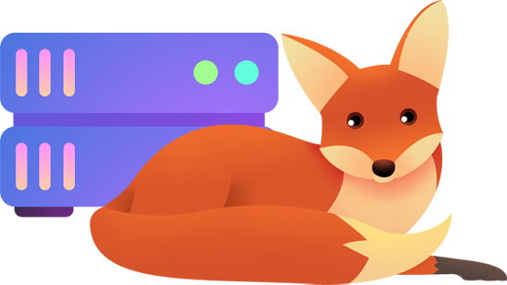
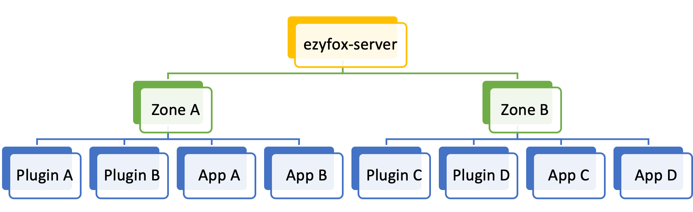
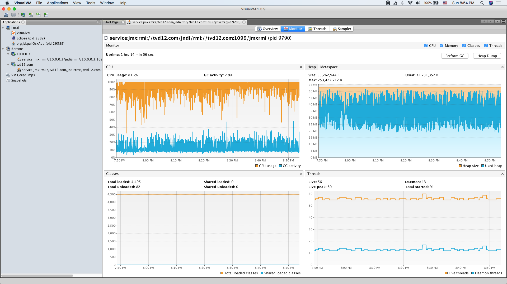

# EzyFox Server


[](https://github.com/youngmonkeys/ezyfox-server/actions/workflows/maven.yml)

[](https://star-history.com/#youngmonkeys/ezyfox-server)

<div align="center">
    
</div>

<div align="center">
⚡ Empowering real-time experiences effortlessly ⚡
</div>

## 📖 Introduction

An Open Solution for all your Real-Time needs.

To develop online games rapidly, developers often need to use a game server engine like SmartFoxServer or Photon. Unfortunately, these engines come with a high price tag, especially as more and more users engage with our products. That's why we developed the EzyFox ecosystem, which aims to be free and open for anyone interested in building multiplayer games and applications.

The EzyFox ecosystem supports a wide range of essential components for enterprise product development, including TCP, UDP, WebSocket protocols with SSL encryption, HTTP RESTful API, Remote Procedure Call (RPC) protocol, Database Interaction, Memory Caching, and Message Queue.

With the EzyFox ecosystem, we can avoid the headache of choosing which technologies to use to manage and scale up an application, allowing us to focus solely on implementing business logic.

## ✨ Features

* **Core Container & Dependency Injection**: Includes bean manipulation, auto-binding, auto-implementation, and more.
* **Multiple Communication Protocols**: Supports TCP, UDP, WebSocket, and HTTP.
* **Traffic Encryption**: Allows for traffic between clients and servers to be encrypted using SSL.
* **Multiple Client SDKs**: Includes Android, iOS, Unity, React, C++, Flutter, and more.


## 🚀 Getting Started

[Let's see how we can getting started just in 5 minutes!](https://youngmonkeys.org/get-started/)

## 📑 Documentation

- [Official website document](https://youngmonkeys.org/projects/ezyfox-server)
- [Issue](https://github.com/youngmonkeys/ezyfox-server/issues)

## 📐 Architect Overview
<div align="center">
    
</div>

-----------

- A EzyFox Server will contain multi zones
- A zone will contain zone's user manager mutl apps and multi plugins
- An App will contain app's user manager
- A Plugin just handle events and client's requests

See more detail about Sever Architect [here](https://youngmonkeys.org/ezyfox-server/guides/ezyfox-server-architecture)

## ✏️ Examples

1. [Free Chat](https://youngmonkeys.org/asset/freechat/)
2. [Space Game Cocos2d-x](https://youngmonkeys.org/asset/space-game/)
3. [Space Shooter Unity](https://youngmonkeys.org/asset/space-shooter/)
4. [Lucky Wheel Phaser HTML5](https://youngmonkeys.org/asset/lucky-wheel/)
5. [One Two Three Simple Game Server](https://github.com/tvd12/ezyfox-server-example/tree/master/one-two-three)
6. [Easy Smashers Unity](https://github.com/vu-luong/EzySmashers)

## 📜 Tutorials

1. [EzyChat](https://youtube.com/playlist?list=PLlZavoxtKE1IfKY7ohkLLyv6YkHMkvH6G): A simple realtime chat application
2. [EzyRoulette](https://youtube.com/playlist?list=PLlZavoxtKE1LD6qI87wp3YjLGzL8rMbSG): A simple lucky wheel game

## 🔥 Benchmark

Ezyfox Server's benchmark involved broadcasting messages to 1000 concurrent users in one hour on a VPS with 512MB of RAM and 1 CPU core. You can [watch this video](https://youtu.be/TiSLOWIid5o) to see how we conducted the test.



## 🔌 Client SDKs

1.  [Android](https://github.com/youngmonkeys/ezyfox-server-android-client)
2.  [C/C++](https://github.com/youngmonkeys/ezyfox-server-cpp-client)
3.  [CSharp](https://github.com/youngmonkeys/ezyfox-server-csharp-client)
4.  [Flutter](https://github.com/youngmonkeys/ezyfox-server-flutter-client)
5.  [Java](https://github.com/youngmonkeys/ezyfox-server-java-client)
6.  [Javascript ECMAScript 6](https://github.com/youngmonkeys/ezyfox-server-es6-client)
7.  [Javascript](https://github.com/youngmonkeys/ezyfox-server-js-client)
8.  [Netty](https://github.com/youngmonkeys/ezyfox-server-netty-client)
9.  [Swift](https://github.com/youngmonkeys/ezyfox-server-swift-client)
10. [React Native](https://github.com/youngmonkeys/ezyfox-react-native-client)

## 🔨 Development
### Environment
- JDK 1.8
- Maven

### Tests

Navigate to the source folder and run:
```
mvn test
```

## 🎉 Who uses EzyFox?
As the EzyFox Community grows, we'd like to keep track of our users. Please send a PR with your organization name if you are using EzyFox.

Currently, the following organizations are officially using EzyFox:

1. [Defi Warrior](https://defiwarrior.io/)
2. ...
3. Your awesome project ✨

## 💖 Support Us
[Make a Meaningful Donation 😎](https://youngmonkeys.org/donate/)

Currently, our operating budget is fully supported by our own salaries, and all product development is still based on voluntary contributions from a few organization members. The low budget is causing significant difficulties for us. Therefore, with a clear roadmap and an ambitious goal to provide intellectual products for the community, we would greatly appreciate your support in the form of a donation to help us take further steps. Thank you in advance for your meaningful contributions!

## ☎️ Contact Us

- Get in touch with us on [Facebook](https://www.facebook.com/youngmonkeys.org)
- Ask us on [stackask.com](https://stackask.com)
- Email us at [Dzung](mailto:itprono3@gmail.com)